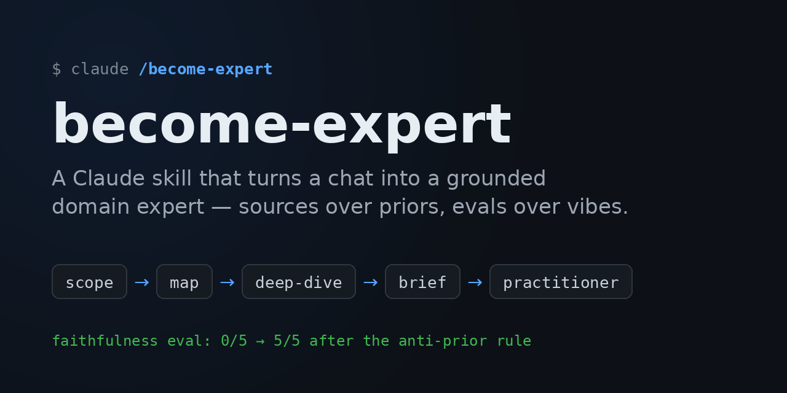
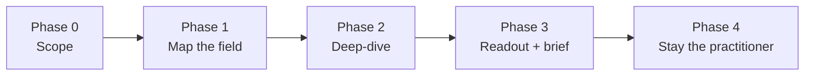

<p align="center">
  
</p>

<h1 align="center">become-expert</h1>

<p align="center">
  A <a href="https://docs.claude.com/en/docs/agents-and-tools/agent-skills/overview">Claude Agent Skill</a> that turns a chat into a working domain expert —<br>
  by researching current sources with a verification protocol, not by role-playing one.
</p>

<p align="center">
  
  
  
</p>

---

Ask Claude to *"become an expert in X"* and, by default, you get an expert **persona**: confident tone, training-data facts, no sources. This skill replaces that with a research protocol. Claude maps the field's actual vocabulary, reads primary sources, logs every load-bearing claim with a verification status, and then continues your conversation as a practitioner who can cite what backs each answer — plus hands you a reusable **field brief** that transfers the expertise to future chats.

```
/become-expert distributed consensus protocols
```

## Why this exists

Three failure modes show up whenever an LLM is asked for expertise, and each one is a design input here:

| Failure mode | What goes wrong | What the skill does instead |
|---|---|---|
| **Persona without grounding** | "Act as an expert" improves tone, not accuracy — and can hurt it | No persona. Expertise comes from sources read this session |
| **Verification rounding-up** | Research agents rarely lie; they *round up* — plausible → "verified" | Every claim carries a status: `verified`, `single-source`, `contested`, `inference`, or `prior-knowledge`, with rules that make each auditable |
| **Stale priors beating fresh sources** | When sources contradict training data, models quietly side with training data | An explicit anti-prior rule: 2+ authoritative sources win, logged as *"the sources establish X; this runs against common belief"* |

## How it works



- **Scope** — establish what the expertise is *for*; decompose into 4–7 sub-questions with a search budget.
- **Map** — broad searches to learn the field's structure and insider vocabulary (you can't search for a concept you don't have a name for).
- **Deep-dive** — a steered loop, one sub-question at a time: each source's gaps choose the next queries. Covers syntheses, primary sources, expert commentary, and live disagreements. Maintains the claims log throughout.
- **Readout + brief** — a conversational readout (the live debates, with names on each side), plus a standalone `field-brief-<topic>.md` that skips the research phase in any future chat. A five-point landing checklist audits citations before anything ships.
- **Practitioner** — for the rest of the session, answers cite their backing source, flag what's contested, and trigger follow-up searches instead of improvising.

## Design decisions

The interesting engineering here is epistemic, not architectural:

- **"Independent sources" means independent origins.** Two pages of a vendor's docs are one source. This single rule kills the most common silent inflation of "verified," since the most findable sources about any product are the vendor's own.
- **`inference` and `prior-knowledge` are first-class statuses.** A derived conclusion is often the most valuable thing a practitioner produces — but it must wear its label, so it never gets laundered into "verified."
- **Search results are not sources.** Every citation must trace to a log entry marked `read` (actually fetched) or `search-level` (seen in a snippet) — and search-level can never back a claim.
- **Fetched text is treated as lossy paraphrase.** Nothing from a fetch is quoted as verbatim unless confirmably verbatim.
- **The anti-prior rule is load-bearing** (see evals below). Training data is precisely what's most likely to be stale, so when well-supported sources contradict it, the sources win — logged explicitly, never smoothed over.

## Evals

The anti-prior rule wasn't added on intuition. In the `faithfulness-suite` eval, the agent researches a **counter-factual corpus** — sources deliberately constructed to invert a strong prior — and is scored on whether its answers follow the sources or the prior:

| Configuration | Sources-faithful runs |
|---|---|
| Without the anti-prior rule | **0 / 5** |
| With the rule operationalized | **5 / 5** |

Every run failed before the rule; every run passed after. The eval harness lives in a separate repo.

## Install

Copy the skill into your Claude config's skills directory (Claude Code shown; any surface that loads Agent Skills works):

```bash
git clone https://github.com/benjaminematton/become-expert-skill.git
cp -R become-expert-skill ~/.claude/skills/become-expert
```

Then invoke it naturally — "become an expert in…", "get up to speed on…", "ground yourself in…" — or explicitly with `/become-expert <topic>`. Supplying a previously generated field brief skips straight to practitioner mode.

## Repo structure

```
SKILL.md                      # the skill: protocol, claim statuses, landing checklist
references/brief-template.md  # the field-brief format (full + mini variants)
deploy.sh                     # syncs the repo (source of truth) to local Claude config dirs
assets/                       # social preview / banner
```

This repo is the source of truth; installed copies are deploys. Edit here, commit, run `./deploy.sh`.

## License

[MIT](LICENSE)
